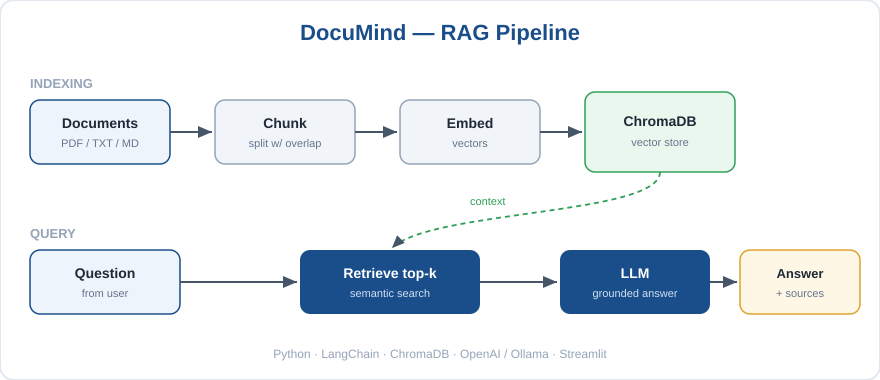

# DocuMind

A small RAG (Retrieval-Augmented Generation) app I built to learn how to make an
LLM answer questions from your own documents instead of making things up. You upload
a PDF or text file, ask a question, and it replies using only what's in the file and
tells you which file the answer came from.

Built with Python, LangChain, ChromaDB and Streamlit. Works with the OpenAI API or a
local model through Ollama.


## What it does

- Loads PDF / TXT / MD files and splits them into chunks
- Embeds the chunks and stores them in a Chroma vector database
- On a question, retrieves the most similar chunks and passes them to the LLM
- The prompt forces the model to answer only from those chunks (this is what stops hallucination)
- Shows the source file name with every answer
- Runs on OpenAI or a fully local Ollama model

## How it works



Main pieces:
- `rag/ingest.py` - load, chunk, embed, store
- `rag/chain.py` - retrieve chunks + build the answer
- `app.py` - the Streamlit chat UI

## Setup

```bash
git clone https://github.com/kirubakaran-7/documind-rag.git
cd documind-rag
python -m venv .venv
.venv\Scripts\activate            # mac/linux: source .venv/bin/activate
pip install -r requirements.txt
cp .env.example .env              # add your key, or use Ollama
streamlit run app.py
```

For OpenAI, put your `OPENAI_API_KEY` in `.env`.
For a free local setup, install [Ollama](https://ollama.com) and run:
```bash
ollama pull llama3.1
ollama pull nomic-embed-text
```

## Quick test

There's a sample file in `sample_docs/`. Upload `company_faq.txt`, build the knowledge
base, and try:

```
Q: How many paid leave days do employees get?
A: 24 paid leave days per year, plus 12 public holidays. (Sources: company_faq.txt)
```

## Running tests

```bash
pip install pytest python-dotenv
pytest -q
```

## What I learned

- How chunk size and overlap affect what the retriever finds
- Why grounding the prompt in retrieved context matters so much
- How to keep the code backend-agnostic so I can swap OpenAI for a local model

## TODO / ideas

- Keep the vector store between runs (right now it rebuilds each time)
- Show the actual chunks that were used
- Support .docx and web URLs
- Put a live demo on Streamlit Cloud

## License

MIT
